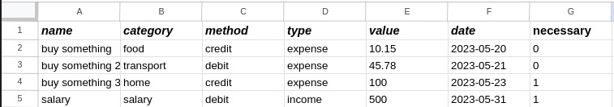
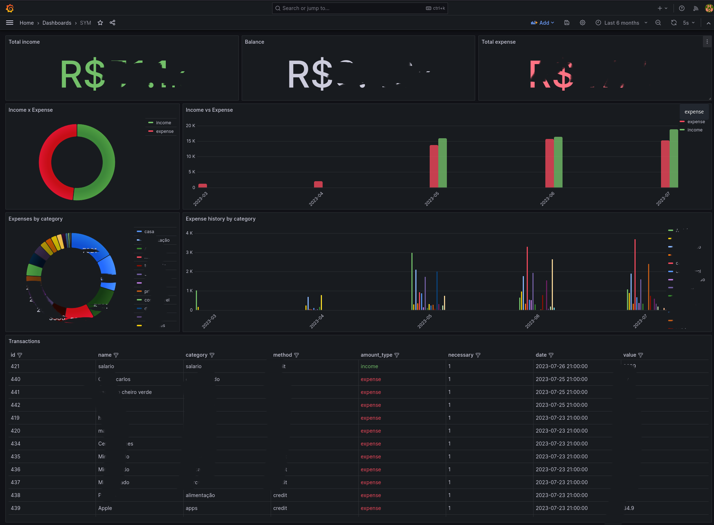

## Share spreadsheet with the service account

1. Create GCP project;
2. Enable API (<b>Google Sheets API</b> and <b>Google Drive API</b>);
3. Create a service account;
4. Create a new credential key ( json type ).;
5. Share spreadsheet with the service account;

<a href='https://developers.google.com/workspace/guides/get-started'>Follow the instructions.</a>


## Configure MySQL database 
```sql
CREATE DATABASE sym;

CREATE TABLE amounts (
  id int NOT NULL AUTO_INCREMENT,
  name varchar(45) DEFAULT NULL,
  category varchar(45) DEFAULT NULL,
  method varchar(45) DEFAULT NULL,
  amount_type varchar(45) DEFAULT NULL,
  necessary tinyint DEFAULT NULL,
  date datetime DEFAULT NULL,
  value float(10,2) DEFAULT NULL,
  PRIMARY KEY (id),
  UNIQUE KEY id_UNIQUE (id)
) ENGINE=InnoDB AUTO_INCREMENT=463 DEFAULT CHARSET=utf8mb4 COLLATE=utf8mb4_0900_ai_ci;

```

## Configure environment variables
```bash
export MYSQL_HOST=""
export MYSQL_USER=""
export MYSQL_PASSWORD=""
export MYSQL_DATABASE=""
export MYSQL_PORT=""
export SPREADSHEETS="" # Example: sheet-1,sheet-2
```

## Sheet structure
the sheet needs to be the same structure below:



## Install python libraries
```bash
pip install -r requirements.txt
```

## How to use
Put the ```credentials.json``` file into your project directory and run the following command:
```bash
$ python main.py
```

## Dashboard example
